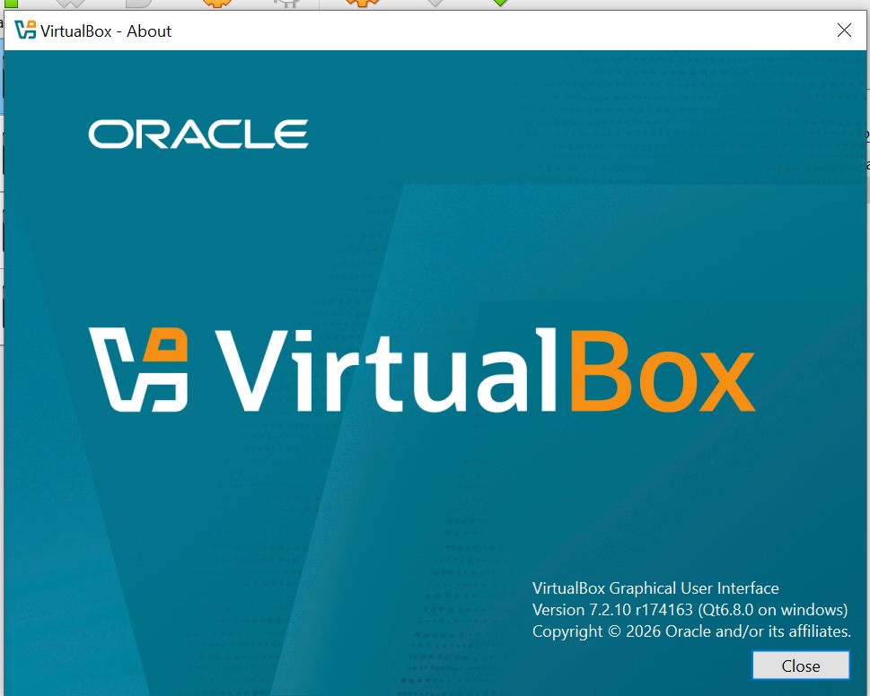
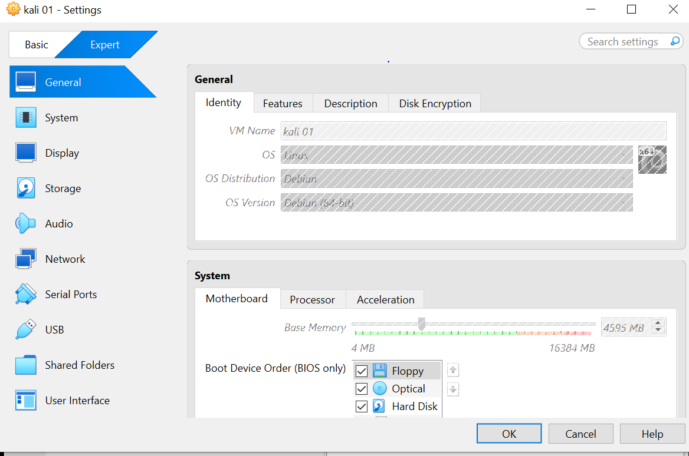
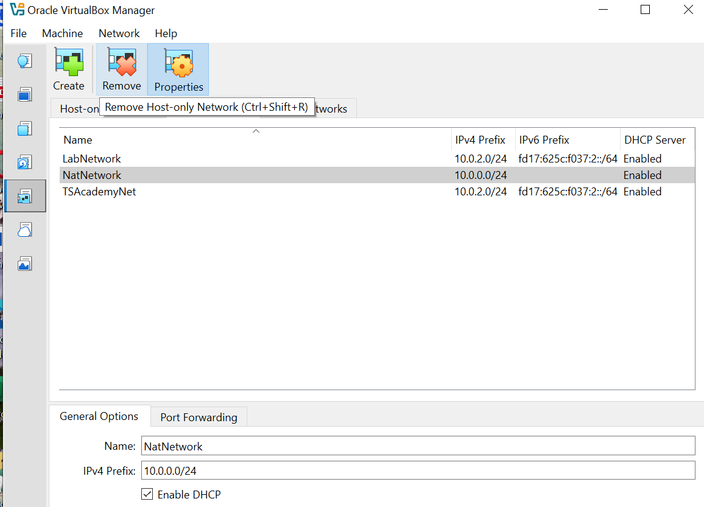
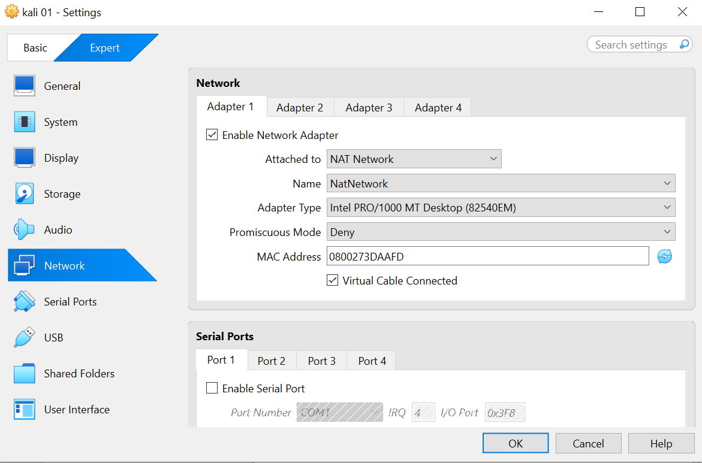
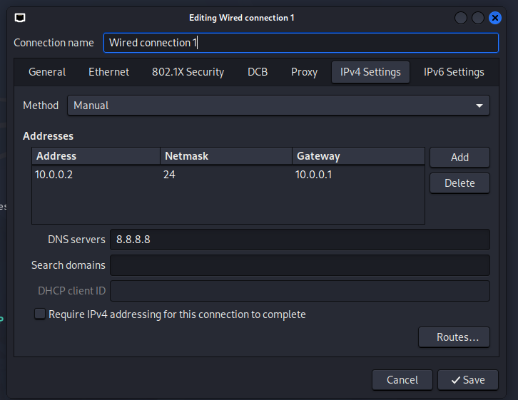
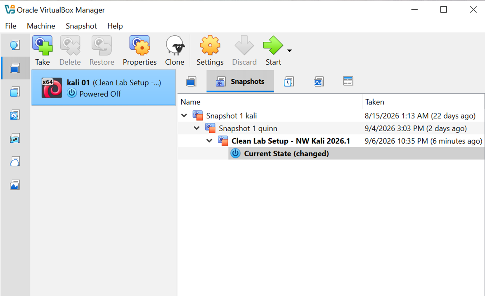

# NETWORKWALKS-B083-WK1-PM1-CYBERSECURITY-LAB-SETUP

## Overview

This project documents the setup and configuration of a cybersecurity testing lab completed as part of my NetworkWalks cybersecurity internship.

The lab environment was built using VirtualBox and Kali Linux, with a private NAT Network configured to provide controlled network connectivity for future cybersecurity and ethical hacking exercises.

The project also focuses on documenting the configuration process, network verification, troubleshooting, and the final recovery snapshot created after successful setup.

## Purpose of the Lab

The purpose of this lab is to create a stable and controlled cybersecurity testing environment that can be used for practical security exercises throughout my internship.

The environment provides a safe space to practice reconnaissance, scanning, enumeration, vulnerability assessment, penetration testing, and security tool usage without affecting unauthorized systems.

## Objectives

- Install and configure VirtualBox as the virtualization platform.
- Set up Kali Linux as the primary cybersecurity testing machine.
- Create a private NAT Network using the provided IP and subnet.
- Configure Kali Linux with the static IP address provided.
- Configure the gateway.
- Configure DNS.
- Verify gateway, Internet, and DNS connectivity.
- Troubleshoot network connectivity where necessary.
- Create a clean VM snapshot for recovery.
- Document the complete lab setup for future reference and portfolio development.

## Lab Environment

| Component | Configuration |
|---|---|
| Host OS | Windows |
| Virtualization Platform | Oracle VirtualBox 7.2.10 |
| Attacking Machine | Kali Linux 2026.1 |
| VM Name | kali 01 |
| Network Type | NAT Network |
| NAT Network Name | NatNetwork |
| Network Subnet | `10.0.0.0/24` |
| Kali IP Address | `10.0.0.2/24` |
| Default Gateway | `10.0.0.1` |
| DNS Server | `8.8.8.8` |
| DHCP | Enabled |
| Clean Snapshot | Clean Lab Setup - NW Kali 2026.1 |

## Tools & Resources

- Oracle VirtualBox
- Kali Linux
- NetworkManager (`nmcli`)
- Linux networking utilities
- ICMP/Ping
- Google DNS (`8.8.8.8`)
## Lab Setup Procedure

### 1. Install VirtualBox

Oracle VirtualBox was installed on the Windows host system as the virtualization platform for the cybersecurity lab.

**Version used:** VirtualBox 7.2.10



### 2. Install Kali Linux

Kali Linux 2026.1 was installed as the primary cybersecurity testing machine.

The virtual machine was named:

`kali 01`



### 3. Create the Private NAT Network

A private NAT Network was created in VirtualBox with the following configuration:

- **Network Name:** `NatNetwork`
- **IPv4 Prefix:** `10.0.0.0/24`
- **DHCP:** Enabled



The NAT Network provides controlled connectivity between virtual machines and external networks while keeping the lab environment isolated from the physical network.

### 4. Configure Kali Network Adapter

Kali Linux Adapter 1 was configured to use the newly created `NatNetwork`.

The adapter was configured as:

- **Attached to:** NAT Network
- **Network Name:** `NatNetwork`
- **Adapter Type:** Intel PRO/1000 MT Desktop (82540EM)
- **Promiscuous Mode:** Deny
- **Cable Connected:** Enabled



### 5. Configure Kali Static IP

The Kali `eth0` interface was configured with a static IPv4 address using NetworkManager.

## Configuration:

```text
IP Address:  10.0.0.2/24
Gateway:     10.0.0.1
DNS:         8.8.8.8
```


The NetworkManager connection was also configured with the required Duplicate Address Detection workaround for the Kali/VirtualBox environment:

```
sudo nmcli connection modify "Wired connection 1" ipv4.dad-timeout 0
```
The connection was then restarted:

```
sudo nmcli connection down "Wired connection 1"
sudo nmcli connection up "Wired connection 1"
```


## Lab Configuration:

The final network configuration was:

```
Network:       10.0.0.0/24
Kali IP:       10.0.0.2/24
Gateway:       10.0.0.1
DNS:           8.8.8.8
DHCP:          Enabled
Interface:     eth0
```
## Lab Verification:

Verified Kali IP Address
```
ip addr show eth0
```
Result
```
inet 10.0.0.2/24
```
Verified Routing
```
ip route
```
Tested Gateway and Internet Connectivity
```
ping -c 4 10.0.0.1
ping -c 4 8.8.8.8
```
Result: 4 packets received, 0% packet loss.

Tested DNS Resolution
```
ping -c 4 google.com
ping -c 4 networkwalks.com
```


Result: Both domains successfully resolved to an IPv4 addresses and returned 4 replies with 0% packet loss.

These tests confirmed that the kali machine had:

- Local gateway connectivity
- Internet connectivity
- Working DNS resolution

## Clean Lab Snapshot

After successfully completing and verifying the lab configuration, a clean VirtualBox snapshot was created to provide a recovery point before beginning future cybersecurity exercises.

The snapshot was named:

`Clean Lab Setup - NW Kali 2026.1`



## Challenges Encountered & Solutions

### 1. NAT Network Subnet Mismatch

The existing VirtualBox NAT Network configuration used a different subnet from the one required for the internship lab.

**Solution:**  
A dedicated `NatNetwork` was created and configured with the required `10.0.0.0/24` subnet. 

### 2. Kali Did Not Initially Have the Required IPv4 Configuration

After changing the VirtualBox network adapter to the new NAT Network, Kali did not initially have the required IPv4 address on `eth0`.

**Solution:**  
A static IP configuration was applied using NetworkManager with the following settings:

```text
IP Address: 10.0.0.2/24
Gateway:    10.0.0.1
DNS:        8.8.8.8
```
The connection was then restarted to apply the configuration.

## Lessons Learned

This lab helped me understand that building a cybersecurity lab is not simply about installing Kali Linux and security tools. Network configuration is a critical part of creating a reliable testing environment.

## Some of the Key lessons learned include:

- How VirtualBox NAT Networks provide controlled connectivity for virtual machines.
- How to configure a Linux interface with a static IP using `nmcli`.
- How IP addresses, gateways, DNS, and routing work together.
- How to verify connectivity systematically using `ip route` and `ping`.
- The importance of troubleshooting one network layer at a time.
- The importance of documenting configurations and troubleshooting steps.
- The value of creating a clean VM snapshot before beginning future security exercises.

## Conclusion

The cybersecurity lab was successfully configured and verified. Kali Linux was assigned the required IP address, connected through the private NAT Network, and successfully verified for gateway, Internet, and DNS connectivity.

A clean snapshot was also created to provide a recovery point before beginning future Network Walks cybersecurity exercises.

## Author

Iwunze Queeneth C

## Internship Instructor

Waqas Karim CCIE

## Project Information

Program Name: Cybersecurity Internship at Networkwalks | Week 1 |
Project: Cybersecurity Lab Setup |
Repository: GitHub
